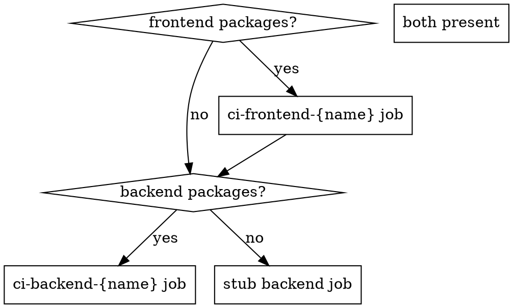

# Project Analysis Reference

## Phase 1 — Discover the workspace

Read `pnpm-workspace.yaml` (or `package.json#workspaces` for npm/yarn) to get the
actual glob patterns. Then resolve every matching directory.

```bash
# Common patterns to resolve:
# "packages/*"  →  packages/web, packages/api, packages/shared ...
# "apps/*"      →  apps/frontend, apps/backend ...
# "libs/*"      →  libs/ui, libs/utils ...
```

Never hardcode `apps/` or `packages/` — always derive from the workspace config.

---

## Phase 2 — Classify each package

For each discovered package directory, read `package.json` and fill in this mental model:

```
Package {
  name        : string    # package.json "name" field — used in --filter
  dir         : string    # relative path from repo root (e.g. "packages/web")
  type        : "frontend" | "backend" | "library" | "unknown"
  framework   : string    # detected from dependencies (see table below)
  scripts     : {}        # key = logical role, value = actual script name
  hasDockerfile : bool
  hasEnvTest  : bool      # .env.test exists in the package dir
}
```

### Framework detection table

| Detected dependency | `type` | `framework` |
|---|---|---|
| `next` | frontend | nextjs |
| `vite` + (`react` / `vue` / `svelte` / `solid-js`) | frontend | vite-{framework} |
| `vite` alone | frontend | vite |
| `@angular/core` | frontend | angular |
| `nuxt` | frontend | nuxt |
| `@nestjs/core` | backend | nestjs |
| `express` | backend | express |
| `fastify` | backend | fastify |
| `hono` | backend | hono |
| `koa` | backend | koa |
| none of the above | library / unknown | — |

### Script detection table

For each package, map logical roles to actual script names by checking what exists:

| Logical role | Try in order |
|---|---|
| `test` | `test:run` → `test` → `vitest run` |
| `testCov` | `test:coverage` → `test:cov` → `coverage` |
| `lint` | `lint` → `check` → `eslint` |
| `typecheck` | `typecheck` → `type-check` → `tsc` |
| `build` | `build` |
| `prisma` | `prisma:generate` → `db:generate` (only if Prisma is in deps) |

---

## Phase 3 — Build the project map

Summarise findings before generating anything:

```
PROJECT MAP
===========
Topology: frontend + backend   (or: frontend-only / backend-only / multi-package)

Packages:
  [frontend] my-app  (packages/web)
    framework : vite-react
    test      : test:run
    testCov   : test:coverage
    typecheck : typecheck  ✓
    lint      : lint  ✓
    build     : build  ✓
    Dockerfile: ✗ (will create)
    .env.test : ✗ (will create)

  [backend] my-api  (packages/api)
    framework : nestjs
    test      : test
    testCov   : test:cov
    lint      : lint  ✓
    build     : build  ✓
    prisma    : ✗ (not detected)
    Dockerfile: ✗ (will create)

Existing CI: none
Protected branches: main, develop
```

**Show this map to the user** before generating files. Ask to confirm / correct.

---

## Phase 4 — Ask only what can't be detected

| Unknown | Question to ask |
|---|---|
| Topology unclear (no workspace config) | "Is this frontend-only, backend-only, or both?" |
| Package type unclear | "What does `{name}` do — frontend, backend, or shared library?" |
| Protected branches (no git remote) | "Which branches should require PRs and passing CI?" |
| Dockerfiles missing | "Should I create Dockerfiles for deployment? (recommended)" |
| External secrets needed (OpenAI, DB, etc.) | "Does the backend need env vars to run tests? List them." |

If all are detected clearly, skip asking and just confirm the project map.

---

## Topology decision — what CI jobs to generate



One CI job per package of each type. For multi-package repos (e.g. 2 frontends),
generate 2 `ci-frontend-*` jobs.
